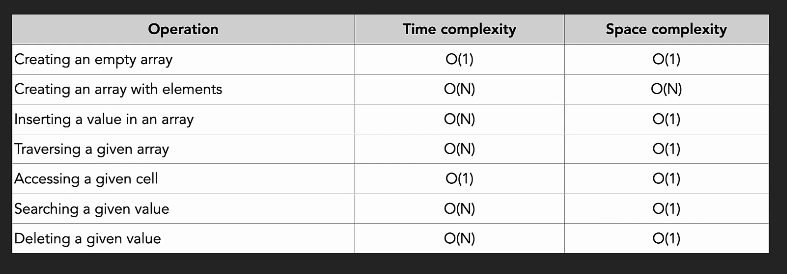

# Array Operations

# 📘 Array Creation in Python 

Create arrays in Python using **List**, **array module**, and **NumPy**.

---

## ✅ 1. Using Python List (Dynamic Array)
Python lists behave like dynamic arrays and are most commonly used in DSA.

### ➤ Create a list
```python
arr = [10, 20, 30]
```

### ➤ Empty list
```python
arr = []
```

### ➤ Using list()
```python
arr = list([1, 2, 3])
```

### ➤ Using range()
```python
arr = list(range(5))   # [0, 1, 2, 3, 4]
```

### ➤ Repeated values
```python
arr = [0] * 5          # [0, 0, 0, 0, 0]
```

---

## ✅ 2. Using `array` Module (True Homogeneous Arrays)
The `array` module stores elements of a single data type.

### ➤ Syntax
```python
from array import array
arr = array('i', [1, 2, 3, 4])   # 'i' = integer
```

### ➤ Empty array
```python
arr = array('i', [])
```

### ➤ Common Typecodes
| Code | Meaning |
|------|---------|
| `i`  | integer |
| `f`  | float   |
| `d`  | double  |

---

## ✅ 3. Using NumPy Arrays (2D, 3D, ML Arrays)
NumPy is used for numerical, scientific, and multi-dimensional arrays.

### ➤ Import
```python
import numpy as np
```

### ➤ Basic array
```python
arr = np.array([1, 2, 3])
```

### ➤ Array with datatype
```python
arr = np.array([1, 2, 3], dtype='int32')
```

### ➤ 2D array
```python
matrix = np.array([[1, 2], [3, 4]])
```

### ➤ Zeros / Ones
```python
np.zeros(5)
np.ones((2, 3))
```

### ➤ Range
```python
np.arange(1, 10, 2)
```


#Array Insertion
## ✅ 1. Insert in Python List
Syntax:
```python
list.insert(index, value)
Example:

python
Copy code
arr = [10, 20, 30, 40]
arr.insert(2, 99)     # insert at index 2
# [10, 20, 99, 30, 40]
⏱ Time Complexity
Inserting at any position: O(n) (elements shift)

✅ 2. Insert in array Module (Homogeneous Array)
python
Copy code
from array import array
arr = array('i', [1, 2, 3])
arr.insert(1, 99)
# array('i', [1, 99, 2, 3])
✅ 3. Insert in NumPy Array
NumPy creates a new array when inserting.

python
Copy code
import numpy as np
arr = np.array([10, 20, 30])
new_arr = np.insert(arr, 1, 99)
# [10 99 20 30]
⏱ Time Complexity
Insert: O(n)


# Time and Space Complexity for Array Operations
